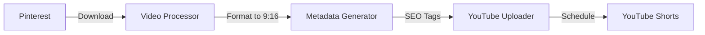

# Pinterest to YouTube Shorts Automation Agent

[]()
[](https://opensource.org/licenses/MIT)

An automated AI agent that downloads food-related videos from Pinterest and uploads them to YouTube Shorts with optimized timing, descriptions, and hashtags for monetization.

## ✨ Features

- 🎯 **Automated Downloads** - Fetches food-related videos from Pinterest
- 📤 **Smart Uploads** - Uploads to YouTube Shorts with proper metadata
- ⏰ **Optimal Timing** - Schedules uploads at peak engagement times (8AM, 12PM, 7PM)
- 🏷️ **SEO Optimization** - Generates engaging titles, descriptions, and hashtags
- 📅 **Daily Schedule** - Automatically uploads 3 videos per day
- 🚀 **Free Hosting** - Runs on GitHub Actions (no server costs)
- 💰 **Monetization Ready** - Optimized for YouTube Partner Program

## 🎯 How It Works



### Daily Workflow

1. **8:00 AM** - Breakfast time upload (people checking phones)
2. **12:00 PM** - Lunch break upload (midday scrolling)
3. **7:00 PM** - Evening peak upload (after work relaxation)

## 📋 Prerequisites

- Pinterest account (for video sources)
- YouTube channel with Shorts enabled
- Google Cloud project with YouTube Data API v3
- GitHub account (for hosting automation)

## 🚀 Quick Start

### 1. Clone Repository
```bash
git clone https://github.com/YOUR_USERNAME/YOUR_REPO.git
cd YOUR_REPO
```

### 2. Get API Credentials

#### YouTube API
1. Visit [Google Cloud Console](https://console.cloud.google.com/)
2. Create project → Enable YouTube Data API v3
3. Create OAuth 2.0 credentials (Desktop app)
4. Run locally to get refresh token:
   ```bash
   pip install google-auth google-auth-oauthlib google-api-python-client
   python get_refresh_token.py
   ```

#### Pinterest API
1. Visit [Pinterest Developers](https://developers.pinterest.com/)
2. Create an app
3. Generate access token with `pins:read` permission

### 3. Configure GitHub Secrets

Go to your repo: **Settings → Secrets and variables → Actions**

| Secret | Description |
|--------|-------------|
| `YOUTUBE_CLIENT_ID` | OAuth Client ID from Google |
| `YOUTUBE_CLIENT_SECRET` | OAuth Client Secret from Google |
| `YOUTUBE_REFRESH_TOKEN` | From `get_refresh_token.py` script |
| `PINTEREST_ACCESS_TOKEN` | From Pinterest Developer Portal |
| `TIMEZONE` | Your timezone (e.g., `America/New_York`) |

### 4. Deploy

```bash
git add .
git commit -m "Deploy YouTube Shorts automation"
git push origin main
```

The workflow will automatically run at scheduled times!

## 📁 Project Structure

```
├── .github/workflows/
│   └── upload-short.yml      # GitHub Actions schedule
├── src/
│   ├── main.py               # Main orchestration agent
│   ├── pinterest_downloader.py
│   ├── video_processor.py    # Format to 9:16 vertical
│   ├── metadata_generator.py # SEO titles & tags
│   ├── youtube_uploader.py   # YouTube API integration
│   └── scheduler.py          # Optimal timing logic
├── config/
│   └── settings.py           # Configuration
├── get_refresh_token.py      # OAuth helper
├── requirements.txt
├── SETUP_GUIDE.md            # Detailed setup instructions
└── README.md
```

## ⚙️ Configuration

### Food Keywords (Auto-Rotating)
```python
FOOD_KEYWORDS = [
    "easy recipes", "quick meals", "food hacks",
    "cooking tips", "dessert recipes", "healthy food",
    "street food", "baking recipes", "pasta recipes",
    "chicken recipes", "vegetarian recipes", ...
]
```

### Video Specifications
- **Aspect Ratio**: 9:16 (vertical)
- **Resolution**: 1080x1920 (optimal)
- **Duration**: 15-60 seconds
- **Format**: MP4 (H.264 codec)

### Generated Metadata
- Catchy titles with emojis
- SEO-optimized descriptions
- Trending hashtags (#food, #shorts, #recipe, etc.)
- Relevant tags for discoverability

## 📊 Monetization Strategy

### YouTube Partner Program Requirements
- ✅ 1,000 subscribers
- ✅ 4,000 watch hours (12 months) OR 10M Shorts views (90 days)
- ✅ Follow all policies

### Growth Tactics Built-In
1. **Consistency** - 3 uploads daily at optimal times
2. **SEO** - Auto-generated titles, tags, descriptions
3. **Trending Niche** - Food content has high engagement
4. **Hashtags** - Mix of popular and niche tags
5. **Timing** - Posts when audience is most active

## 🔧 Manual Commands

```bash
# Check upload schedule
python src/main.py --schedule

# Force immediate upload
python src/main.py --force

# Check channel status
python src/main.py --status
```

## ⚠️ Important Notes

### Content Rights
- Only use content you have rights to
- Transform downloaded content sufficiently
- Consider creating original content
- Follow fair use guidelines

### API Limits
- YouTube: 10,000 units/day quota
- Pinterest: Rate limits apply
- GitHub Actions: 2,000 minutes/month (free tier)

### Best Practices
- Test locally before enabling automation
- Monitor upload logs regularly
- Review YouTube Analytics weekly
- Adjust keywords based on performance

## 🐛 Troubleshooting

| Issue | Solution |
|-------|----------|
| Auth failed | Regenerate refresh token |
| No videos downloaded | Check Pinterest token |
| Upload fails | Verify video format |
| Workflow not running | Enable GitHub Actions |

See [SETUP_GUIDE.md](SETUP_GUIDE.md) for detailed troubleshooting.

## 📈 Performance Tips

1. **Monitor Analytics** - Check which videos perform best
2. **A/B Test Titles** - Experiment with different formats
3. **Engage with Comments** - Boost algorithm favorability
4. **Cross-Promote** - Share on other social platforms
5. **Stay Consistent** - Algorithm rewards regularity

## 📝 License

MIT License - See LICENSE file for details

## 🤝 Contributing

Contributions welcome! Please feel free to submit a Pull Request.

## 📞 Support

- Open an issue for bugs
- Check GitHub Actions logs first
- Review SETUP_GUIDE.md for common problems

---

**Made with ❤️ for content creators**

*Disclaimer: This tool is for educational purposes. Ensure you comply with all platform Terms of Service and copyright laws.*
